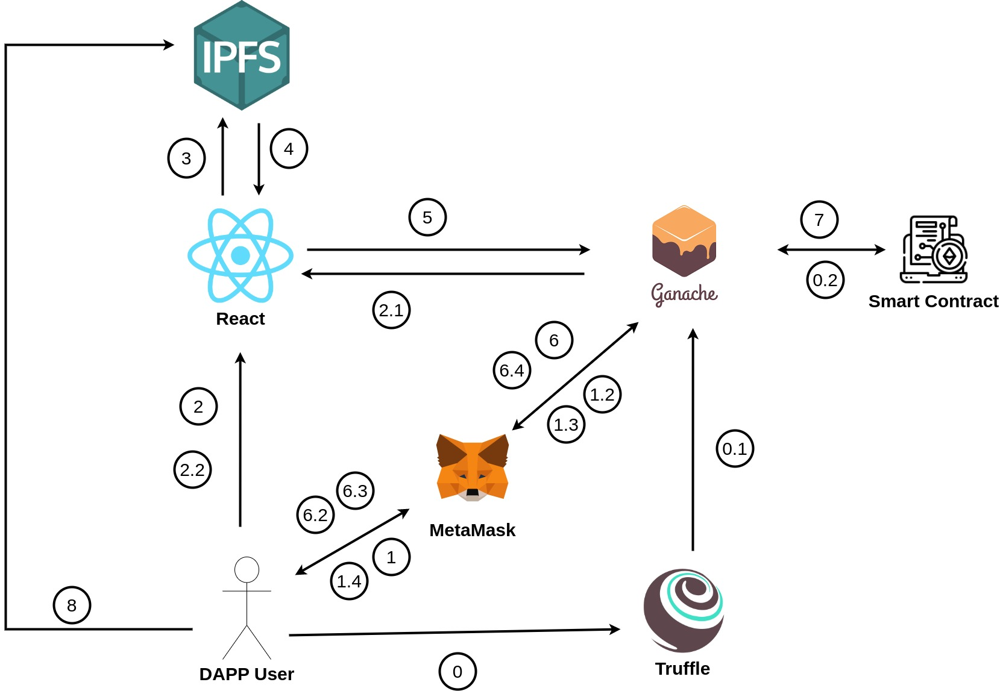
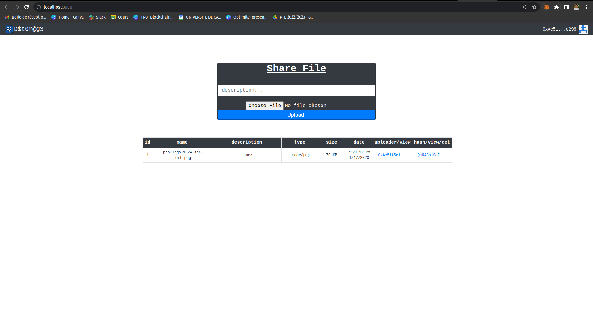

# Decentralized Storage

## Introduction

This repository consists of our team's submission for the Blockchain project.

Team members:

- Ramez Ben Aribia
- Amine Haj Ali
- Mahdi Hamdi
- Chaima Akkari

## Requirements

To be able to run the project, you will need.

- MetaMask on your browser
- Docker to be able to run `docker compose up` and start IPFS
- Ganache desktop
- Truffle by running `npm install -g truffle`

Run `npm install` to install project dependencies and run `npm start` to start the React Dapplication.

## 🔧 Project Diagram:

So let's go through the different steps.

0 Compile smart contract.

0.1.Migrate smart contract to ganache blockchain.

0.2 Add smart contract to blockchain block.

All of the previous steps are done when running `truffle migrate --reset`

1 Connect to blockchain via Web3 API.

2 Run Dapp and upload file.

3 File is published in IPFS.

4 File Hash - which is the content identifier is returned.

5 The CID is added to smart contract.

6 Transaction is approved using MetaMask.

7 Details are added to smart contract.

8 Download the file.

## Execution

## Explanation Video

https://drive.google.com/drive/folders/1nWRIsCSaLLmW13wz6xeYjI0amB1n5gxe?usp=sharing
